<h1>Haiiii, I'm AmazingKeymaster</h1>

I build things, I break things, and sometimes I stream the process. 
If it's code, tech, or anything that goes beep, I'm probably messing with it.

<!-- Socials -->

  
  
  

<h3>About Me</h3>

• I Write code that sometimes behaves 
• I Build random tools because I got curious 
• I like to play Minecraft and project sekai 

<h3>Stats & Stuff</h3>

